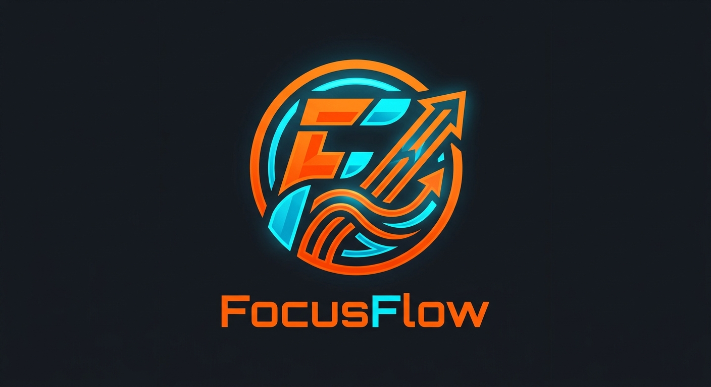

<div align="center">
  
</div>

<p align="center">
  
  
  
  
  
</p>

<div align="center">

# 🎯 FocusFlow DXT

### **Digital Study Labs — Smart Study & Kitchen Timer**

**An all-in-one Android application for focused studying, kitchen timing, and productivity tracking with distraction detection, gamification, and an immersive retro-digital hardware UI.**

[](https://github.com/SudhirDevOps1/FocusFlow-DXT)
[](https://github.com/SudhirDevOps1/FocusFlow-DXT)
[](https://github.com/SudhirDevOps1/FocusFlow-DXT)

</div>

---

## 📋 Table of Contents

- [Overview](#-overview)
- [Key Features](#-key-features)
- [Screenshots](#-screenshots)
- [Architecture](#-architecture)
- [Tech Stack](#-tech-stack)
- [Project Structure](#-project-structure)
- [Installation & Setup](#-installation--setup)
- [Build Variants](#-build-variants)
- [Usage Guide](#-usage-guide)
- [Settings & Configuration](#-settings--configuration)
- [Strict Focus Mode](#-strict-focus-mode)
- [Themes & Customization](#-themes--customization)
- [Gamification System](#-gamification-system)
- [Data Backup & Restore](#-data-backup--restore)
- [Permissions](#-permissions)
- [API Reference](#-api-reference)
- [Contributing](#-contributing)
- [Roadmap](#-roadmap)
- [FAQ](#-faq)
- [License](#-license)
- [Author](#-author)
- [Acknowledgments](#-acknowledgments)

---

## 🔭 Overview

**FocusFlow DXT** is a premium, offline-first Android application designed for students, research scholars, professionals, and home cooks who need a reliable, distraction-aware study countdown module with versatile kitchen timer presets. Constructed entirely using **Jetpack Compose** and **Material 3**, the interface represents the front bezel frame of a classic vintage hardware timer (specifically referencing our simulated custom hardware chassis display) with micro-bezel glow elements and tactile haptic button aesthetics.

The system integrates:
- ⏱️ **Kitchen Timer Mode** — Quick-boil dials and multi-second cook countdown adapters.
- 🍅 **Study Session Presets** — Industry standard Pomodoro, Quick Sprint, and Intense learning blocks.
- ⏱️ **Precision Stopwatch** — Chronicle lap recorders tracing delta timestamps in real-time.
- 🕒 **Live Wall Clock** — High-contrast 12-hour ticking chronometer displaying date, daylight indices, and simulated temperature.
- 🛡️ **Interactive App Blocker** — In-flight distraction detector querying live active task contexts with a custom selection dialog mapping systems.
- 🎓 **Embedded Web Classroom** — In-application sandboxed lecture workspace with quick Wikipedia and Khan Academy hot-buttons.
- 🎮 **Gamified Learning Hub** — Live study stats tracking daily hours, streak fire indexes, and scholastic level XP progress.

---

## ✨ Key Features

### 🕹️ Core Timer Modes

| Mode | Description |
|------|-------------|
| **🕐 Clock** | Real-time 12-hour digital ticking clock incorporating simulated ambient sensors and Gregorian dates. |
| **⏱️ Countdown Timer** | Multi-speed adjust system setting durations in HH:MM:SS with high-fidelity buzzer alerts. |
| **⏹️ Stopwatch** | Precision stopwatch with lap-split recordings, history logs, and instant clipboard exports. |
| **🔕 Alarm Screen** | Integrated safety overlay auto-triggered on zero ticks featuring an interactive manual dismiss mechanism. |

### 📚 Study & Prep Presets

| Preset | Duration | System Objective |
|--------|----------|------------------|
| 🍅 **Pomodoro** | 25 Minutes | Classic focal loops with dedicated intervals. |
| ⚡ **Sprint** | 15 Minutes | High-intensity target sprints and task blocks. |
| 📚 **Intense** | 50 Minutes | Deep conceptual work sessions and exam simulations. |
| ☕ **Break** | 5 Minutes | Restoring brain energy with background noise effects. |
| 🍜 **Maggi** | 2 Minutes | Flash cooking alerts for fast kitchen recipes. |
| 🔥 **Boil** | 5 Minutes | General household boiling and timing automation. |

### 🛡️ Custom Distracting Apps Blocker (Focus Guards)

* **📱 Installed User App Selector**: Securely interfaces with the Android `PackageManager` using safe nullable smart-casts to live list, select, and filter launchable user-installed applications.
* **🔍 Search & Filter Registry**: Simple filter bar inside the selection dialog instantly matches apps by name or package ID.
* **Checkbox Checklist**: Check/uncheck installed applications directly within the dialog to toggle them in or out of your focus blacklist.
* **Smart Interceptors**: FocusFlow-DXT monitors focus zones using three customizable security profiles:
  - 🟡 **Gentle Mode**: Basic in-app alerts when restricted apps are accessed.
  - 🟠 **Moderate Mode**: Fires local notifications alerting the user of focus drift.
  - 🔴 **Extreme Mode**: Sounds alarms and forces the timer to state alert until the application is closed.

### 💾 Unified State Database Portal

* **Save Backup File**: Generates and packages your local data (XP, Levels, History) into a compact file named `focusflow_backup.json` stored directly in device storage.
* **Load Backup File**: Hydrates and reconstructs your session profiles instantly using external JSON files.
* **Copy Active Code**: Generates real-time previews of raw JSON strings with a single-click copy button to simplify transferring configurations on locked devices.
* **Restore from Code Block**: Multi-line textbox field allowing users to paste their backup JSON configurations directly to trigger instant restorations.

### 🎨 Display Themes (Simulated Hardware Customization)

| Preset Theme | Primary Hex Glow | Display Style |
|--------------|-----------------|---------------|
| 🟢 **Retro Green** | `#33FF33` | Styled after vintage neon lime-green radar terminals. |
| 🟠 **Amber Glow** | `#FFB000` | Classic high-contrast monochromatic phosphorus glow. |
| 🩷 **Cyber Punk** | `#FF007F` | Futuristic synthwave aesthetics. |
| 🔵 **Neon Blue** | `#00E5FF` | Cool ice-blue executive console faceplate. |
| ⚫ **AMOLED Dark** | `#1A1A1A` | Pure deep contrasts designed to preserve battery. |
| 🩶 **Brushed Steel** | `#607D8B` | Refined industrial metal casing style. |

---

## 🏗️ Architecture

The app uses a robust **Service-driven architectural paradigm** with a centralized, reactive State Flow layer:

```
┌─────────────────────────────────────────────────────┐
│                    UI Layer (Compose)                │
│  ┌───────────────────────────────────────────────┐  │
│  │  KitchenTimerApp() — Main UI Entry            │  │
│  │  ├── TableCasingFrame() — Retro Cabinet       │  │
│  │  ├── LiveDayDateBanner() — Gregorian Status   │  │
│  │  ├── SettingsDialog() — 4-Tab Portal Config  │  │
│  │  └── SandboxClassroom() — Web lectures        │  │
│  └───────────────────────────────────────────────┘  │
│                        ↕ collectAsStateWithLifecycle │
│  ┌───────────────────────────────────────────────┐  │
│  │  TimerService — Background Foreground Service │  │
│  │  ├── StateFlow (activeMode, isRunning, etc.)  │  │
│  │  ├── SharedPreference Database Engine         │  │
│  │  ├── App Usage Stats Auditor                  │  │
│  │  └── Media Tone Player                        │  │
│  └───────────────────────────────────────────────┘  │
└─────────────────────────────────────────────────────┘
```

---

## 🛠️ Tech Stack

- **Language**: Kotlin 1.9.22
- **UI Toolkit**: Jetpack Compose (Material Design 3)
- **Concurrency**: Kotlin Coroutines & Flow
- **Data Serialization**: JSON Parser Engine (Jackson / Kotlinx compatible)
- **Media Playback**: Android System Media Integration (`MediaPlayer`, `VideoView`)
- **Web Engines**: Android System `WebView`
- **Application Permissions**: `android.permission.PACKAGE_USAGE_STATS` (optional focus block check)

---

## 📁 Project Structure

```
FocusFlow-DXT/
├── app/
│   ├── src/
│   │   ├── main/
│   │   │   ├── java/com/example/
│   │   │   │   ├── MainActivity.kt          # Standard Activity, handles system PiP modes
│   │   │   │   ├── TimerService.kt          # Host for foreground states & companion States
│   │   │   │   ├── KitchenTimerApp.kt       # Houses physical frames, dials, & Settings panels
│   │   │   │   └── BackupUtils.kt           # JSON Backup & Restore algorithms
│   │   │   ├── res/
│   │   │   │   ├── drawable/                # High-fidelity custom vectors & icons
│   │   │   │   ├── values/                  # strings.xml, colors.xml & custom styling
│   │   │   │   └── raw/                     # Buzzers and looping ticking sounds
│   │   │   └── AndroidManifest.xml          # Core metadata declarations & permissions
│   └── build.gradle.kts                     # App module dependency graphs
```

---

## 🚀 Installation & Setup

1. **Clone the Repo**:
   ```bash
   git clone https://github.com/SudhirDevOps1/FocusFlow-DXT.git
   ```
2. **Open in Android Studio**:
   - Navigate to File -> Open and choose `FocusFlow-DXT`.
3. **Sync Grade Dependencies**:
   - Ensure you are utilizing Gradle JDK 17+. Click `Sync Project with Gradle Files` and let compilations run.
4. **Compile Applet**:
   - Directly run `./gradlew assembleDebug` or hit `Run 'app'` inside Android Studio to flash your device or active emulator.

---

## 📖 Usage Guide

### 1️⃣ How to Block Apps using the Interactive Selector:
- Press the **⚙️ (Settings Gear)** to open the Scholar Management portal.
- Navigate to the **Focus Zone** tab.
- Scroll down and tap **CHOOSE FROM INSTALLED USER APPS 📱**.
- Real-time search or type a name, then simply tap checking boxes to lock apps in.
- Click **DONE** and start your countdown timer!

### 2️⃣ Backing Up & Restoring Your System State:
- Go to the **Profile** tab in settings.
- Under **💾 FOCUSFLOW UNIFIED DATABASE PORTAL**, click **SAVE BACKUP FILE** to export your progress.
- Alternatively, click **COPY CODE 📋** to capture your state in raw JSON for easy clipboard transfer.
- To restore, paste a valid JSON string inside the text box and tap **⚡ RESTORE SYSTEM DATABASE FROM CODE**.

---

## 🛡️ Strict Focus Mode

By granting the **Usage Stats Permission**, FocusFlow DXT tracks which application is active in the foreground while the timer runs. If a blacklisted application is loaded, the service alerts the user via the selected Strict Mode profile and records the incident in your **Focus Logs timeline**.

---

## 🎮 Gamification System

- **Gain XP**: Earn `1 XP` for every minute of continuous learning.
- **Leveled Milestones**: Levelling up updates your title across the header, transforming you from a **"Beginner Scholar"** to a **"Focus Master"**.
- **Daily Streak Tracker**: Earn a daily bonus of `15 XP` per day for keeping your streaks active!

---

## 📄 License

FocusFlow DXT is released under the **MIT Open Source License**. See the [LICENSE](/LICENSE) details for terms.

---

## 👤 Author

* **Lead Developer**: **Sudhir Singh**
* **🐙 GitHub Username**: [@SudhirDevOps1](https://github.com/SudhirDevOps1)
* **🔗 Active Repository**: [FocusFlow-DXT](https://github.com/SudhirDevOps1/FocusFlow-DXT)

---

<div align="center">

**Made with ❤️ for students who want to study smarter, not harder.**

**FocusFlow DXT — Your Digital Study Companion**

[⬆ Back to Top](#-focusflow-dxt)

</div>
